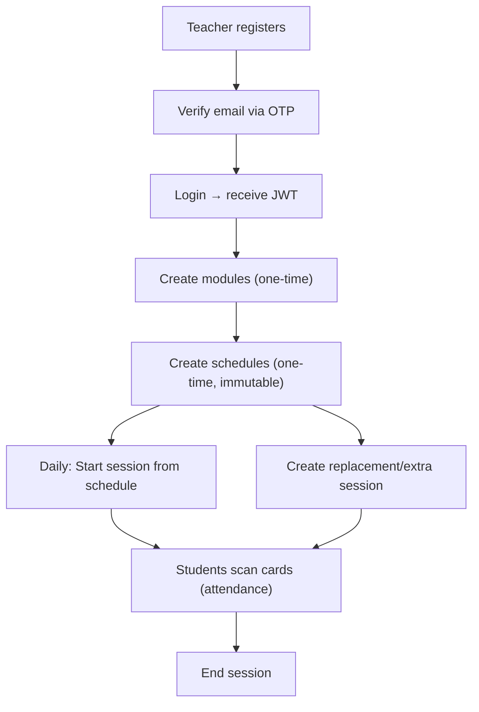

# Smart Attendance System — Frontend Developer Guide

> **Base URL**: `http://localhost:3000`  
> **Swagger Docs**: `http://localhost:3000/api`  
> **Auth**: All protected endpoints require `Authorization: Bearer <JWT_TOKEN>`

This document covers **everything** a frontend developer or AI agent needs to build the Teacher Kit UI. Every endpoint, every payload, every response shape, and the exact workflow sequence.

---

## Architecture Overview



### Key Concepts

| Concept | Description |
|---------|-------------|
| **Schedule** | The static weekly timetable. Created once per semester. **Immutable** — teachers cannot edit or delete. |
| **Session** | A concrete class instance on a specific date. Created when the teacher clicks "Start". |
| **Attendance** | A single student's presence record for one session. |

---

## 1. Authentication

### 1.1 Register Teacher
```
POST /auth/teacher/register
```
**No auth required.** Sends a 6-digit OTP to the teacher's email.

**Request Body:**
```json
{
  "fullName": "Dr. Ahmed Bouzid",
  "email": "teacher@email.com",
  "password": "password123",
  "department": "Computer Science"
}
```
> **NOTE:** Any valid email address can be used for registration.

**Response (201):**
```json
{
  "message": "Registration successful. Please check your email for the OTP code."
}
```

---

### 1.2 Verify OTP
```
POST /auth/teacher/verify-otp
```
**No auth required.** Returns a JWT on success.

**Request Body:**
```json
{
  "email": "teacher@email.com",
  "otp": "481994"
}
```

**Response (201):**
```json
{
  "message": "Email verified successfully",
  "access_token": "eyJhbGciOiJIUzI1NiIs...",
  "role": "teacher"
}
```
> **TIP:** Store `access_token` in localStorage/cookie. Include it as `Authorization: Bearer <token>` on every subsequent request.

---

### 1.3 Teacher Login
```
POST /auth/teacher/login
```
**No auth required.** Only works after OTP verification.

**Request Body:**
```json
{
  "email": "teacher@email.com",
  "password": "password123"
}
```

**Response (201):**
```json
{
  "access_token": "eyJhbGciOiJIUzI1NiIs...",
  "role": "teacher"
}
```

### 1.4 Extract Teacher ID from JWT
The JWT payload looks like this:
```json
{
  "sub": "69f3b7ce5e1e27cc933f1690",
  "role": "teacher"
}
```
**`sub` = the teacher's MongoDB `_id`.** You need this for all teacher-specific API calls.

To decode in JavaScript:
```javascript
const token = "eyJhbGciOiJIUzI1NiIs...";
const payload = JSON.parse(atob(token.split('.')[1]));
const teacherId = payload.sub;  // "69f3b7ce5e1e27cc933f1690"
const role = payload.role;       // "teacher"
```

---

## 2. Teacher Profile

### 2.1 Get Teacher Profile
```
GET /teachers/:teacherId
```
**Auth**: Bearer token (teacher or admin)

**Response (200):**
```json
{
  "_id": "69f3b7ce5e1e27cc933f1690",
  "fullName": "Dr. Test Teacher",
  "email": "teacher@email.com",
  "department": "Computer Science",
  "isVerified": true,
  "createdAt": "2026-04-30T20:18:48.123Z",
  "updatedAt": "2026-04-30T20:18:48.456Z"
}
```

---

## 3. Modules (Academic Subjects)

### 3.1 Create Module
```
POST /modules
```
**Auth**: Bearer token (teacher or admin)

**Request Body:**
```json
{
  "name": "Web Development",
  "teacherId": "69f3b7ce5e1e27cc933f1690",
  "year": "L2"
}
```
> `year` must be one of: `L1`, `L2`, `L3`, `M1`, `M2`

**Response (201):**
```json
{
  "_id": "69f3b7ce5e1e27cc933f1695",
  "name": "Web Development",
  "teacherId": "69f3b7ce5e1e27cc933f1690",
  "year": "L2",
  "createdAt": "2026-04-30T20:18:49.000Z"
}
```

### 3.2 Get Teacher's Modules
```
GET /modules/teacher/:teacherId
```
**Auth**: Bearer token (teacher or admin)

**Response (200):** Array of module objects.

### 3.3 Get All Modules
```
GET /modules
```

### 3.4 Get Module by ID
```
GET /modules/:id
```

---

## 4. Schedules (Static Weekly Timetable)

> **IMPORTANT:** Schedules are **IMMUTABLE** for teachers. Once created, only an Admin can edit or delete them. This is the official university timetable.

### 4.1 Create Schedule
```
POST /schedules
```
**Auth**: Bearer token (teacher or admin)

**Request Body:**
```json
{
  "teacherId": "69f3b7ce5e1e27cc933f1690",
  "moduleId": "69f3b7ce5e1e27cc933f1695",
  "type": "cours",
  "year": "L2",
  "group": "Whole Year",
  "dayOfWeek": "Sunday",
  "startTime": "08:00",
  "endTime": "09:30",
  "room": "Amphi A"
}
```

| Field | Type | Values | Notes |
|-------|------|--------|-------|
| `type` | enum | `cours`, `td`, `tp` | |
| `year` | enum | `L1`, `L2`, `L3`, `M1`, `M2` | |
| `group` | string? | `"2A"`, `"Whole Year"` | Optional for `cours` |
| `dayOfWeek` | enum | `Sunday`–`Saturday` | Capitalized English |
| `startTime` | string | `HH:MM` (24h) | e.g. `"08:00"` |
| `endTime` | string | `HH:MM` (24h) | e.g. `"09:30"` |
| `room` | string | any | e.g. `"Room A101"` |

**Response (201):**
```json
{
  "_id": "69f3b7ce5e1e27cc933f169f",
  "teacherId": "69f3b7ce5e1e27cc933f1690",
  "moduleId": "69f3b7ce5e1e27cc933f1695",
  "type": "cours",
  "year": "L2",
  "group": "Whole Year",
  "dayOfWeek": "Sunday",
  "startTime": "08:00",
  "endTime": "09:30",
  "room": "Amphi A"
}
```

### 4.2 Get Teacher's Schedules
```
GET /schedules/teacher/:teacherId
```
**Auth**: Bearer token

**Response (200):** Array of schedule objects with populated `moduleId`:
```json
[
  {
    "_id": "69f3b7ce5e1e27cc933f169f",
    "teacherId": "69f3b7ce5e1e27cc933f1690",
    "moduleId": { "_id": "...", "name": "Web Development" },
    "type": "cours",
    "year": "L2",
    "group": "Whole Year",
    "dayOfWeek": "Sunday",
    "startTime": "08:00",
    "endTime": "09:30",
    "room": "Amphi A"
  }
]
```

### 4.3 Get All Schedules
```
GET /schedules
```
Returns all schedules with populated `teacherId` and `moduleId`.

### 4.4 Get Schedule by ID
```
GET /schedules/:id
```

> **WARNING:** `PATCH /schedules/:id` and `DELETE /schedules/:id` are **Admin only**. Teachers cannot use these.

---

## 5. Sessions (Daily Class Instances)

This is the core of the system. Sessions are created dynamically when a teacher starts a class.

### 5.1 Start a Session (from Schedule)
```
POST /sessions/start/:scheduleId
```
**Auth**: Bearer token (teacher only) — the JWT must belong to the teacher who owns the schedule.

**Request Body:** None (empty POST).

**What happens internally:**
1. Backend reads the schedule.
2. Verifies the JWT teacher matches the schedule's teacher.
3. Checks no session was already started today for this schedule.
4. Creates a new session with `status: "active"`, copying all info from the schedule.

**Response (201):**
```json
{
  "_id": "69f3b9247dfe17946b302668",
  "scheduleId": "69f3b7ce5e1e27cc933f169f",
  "teacherId": "69f3b7ce5e1e27cc933f1690",
  "moduleId": "69f3b7ce5e1e27cc933f1695",
  "date": "2026-04-30T20:18:52.123Z",
  "startTime": "08:00",
  "endTime": "09:30",
  "type": "cours",
  "group": "Whole Year",
  "status": "active",
  "isReplacement": false
}
```

**Error (409):** Session already started today:
```json
{
  "message": "A session for this schedule has already been created today.",
  "error": "Conflict",
  "statusCode": 409
}
```

---

### 5.2 End a Session
```
POST /sessions/:sessionId/end
```
**Auth**: Bearer token (teacher only) — must be the session owner.

**Request Body:** None (empty POST).

**Response (200):**
```json
{
  "_id": "69f3b9247dfe17946b302668",
  "status": "closed",
  "..."
}
```

---

### 5.3 Create a Replacement/Extra Session (تعويض / حصة إضافية)
```
POST /sessions
```
**Auth**: Bearer token (teacher or admin)

**Request Body:**
```json
{
  "teacherId": "69f3b7ce5e1e27cc933f1690",
  "moduleId": "69f3b7ce5e1e27cc933f1695",
  "date": "2026-05-01",
  "startTime": "10:00",
  "endTime": "11:30",
  "type": "td",
  "group": "2A",
  "status": "planned",
  "isReplacement": true,
  "reasonForReplacement": "Extra revision class before exams"
}
```
> **TIP:** Do NOT send `scheduleId` for replacement sessions — they are independent of the timetable.

---

### 5.4 Get Teacher's Sessions
```
GET /sessions/teacher/:teacherId
```
**Auth**: Bearer token

**Response (200):**
```json
[
  {
    "_id": "69f3b9247dfe17946b302668",
    "scheduleId": "...",
    "teacherId": "...",
    "moduleId": { "_id": "...", "name": "Web Development" },
    "date": "2026-04-30T20:18:52.123Z",
    "startTime": "08:00",
    "endTime": "09:30",
    "type": "cours",
    "group": "Whole Year",
    "status": "closed",
    "isReplacement": false
  }
]
```

### 5.5 Get All Sessions (optionally by date)
```
GET /sessions
GET /sessions?date=2026-04-30
```

### 5.6 Get Session by ID
```
GET /sessions/:id
```
Returns a fully populated session with teacher name/email and module name.

### 5.7 Update Session Status (Admin/Teacher)
```
PATCH /sessions/:id/status
```
**Request Body:**
```json
{ "status": "active" }
```

### 5.8 Delete Session (Admin only)
```
DELETE /sessions/:id
```

---

## 6. Attendance

### 6.1 Record Student Scan
```
POST /attendance/scan
```
**Auth**: Bearer token (teacher or admin)

**Request Body:**
```json
{
  "sessionId": "69f3b9247dfe17946b302668",
  "studentId": "69f3b7b45e1e27cc933f1680",
  "status": "present"
}
```

| Field | Values |
|-------|--------|
| `status` | `present`, `late`, `absent` |
| `scanTime` | Optional ISO string. Auto-set if omitted. |

**Response (201):**
```json
{
  "_id": "69f3b9247dfe17946b30266a",
  "sessionId": "69f3b9247dfe17946b302668",
  "studentId": "69f3b7b45e1e27cc933f1680",
  "status": "present",
  "scanTime": "2026-04-30T20:18:53.000Z"
}
```

### 6.2 Get Attendance for a Session
```
GET /attendance/session/:sessionId
```
Returns an array of attendance records with populated student info.

### 6.3 Get Attendance History for a Student
```
GET /attendance/student/:studentId
```

---

## Complete Teacher Workflow (Step by Step)

This is exactly what the frontend should implement:

### Phase 1: Registration & Login (one-time)
1. User fills registration form → `POST /auth/teacher/register`
2. User enters OTP from email → `POST /auth/teacher/verify-otp` → save JWT
3. On subsequent visits → `POST /auth/teacher/login` → save JWT
4. Decode JWT to extract `teacherId` from the `userId` field (Wait, decode returns `userId` from the JWT endpoint? Actually, `sub` is standard, but the `auth.controller` endpoint returns `access_token`.)

### Phase 2: Initial Setup (once per semester)
5. Teacher creates modules → `POST /modules` (for each subject they teach)
6. Teacher creates weekly schedule → `POST /schedules` (one entry per class slot per week)
   - Example: Sunday 08:00 Web Dev, Sunday 10:00 Databases, Tuesday 14:00 Web Dev TD...

### Phase 3: Daily Classroom Flow (every class day)
7. Dashboard loads → `GET /schedules/teacher/:teacherId`
8. Frontend filters schedules to show only **today's day** (e.g., filter `dayOfWeek === "Thursday"`)
9. Each today-schedule shows a **"Start Session"** button
10. Teacher clicks Start → `POST /sessions/start/:scheduleId` → session is now `active`
11. Students scan RFID/QR → `POST /attendance/scan` (for each student)
12. Teacher views live attendance → `GET /attendance/session/:sessionId`
13. Teacher clicks End → `POST /sessions/:sessionId/end` → session is now `closed`

### Phase 4: Exceptions
14. Teacher needs a replacement class → uses "Add Session" form → `POST /sessions` with `isReplacement: true`

### Phase 5: History & Dashboard
15. View all past sessions → `GET /sessions/teacher/:teacherId`
16. View attendance for any session → `GET /attendance/session/:sessionId`

---

## Test Credentials (After Running `npm run seed`)

| Role | Email / ID | Password |
|------|-----------|----------|
| Teacher | `teacher@email.com` | `password123` |
| Admin | `admin@admin.com` | `admin123` |
| Students | `ST1001` – `ST10010` | Birthday format `DDMMYYYY` |

---

## Error Codes Reference

| Code | Meaning |
|------|---------|
| `400` | Bad Request — validation failed or permission denied |
| `401` | Unauthorized — missing/invalid JWT |
| `403` | Forbidden — role not allowed |
| `404` | Not Found — resource doesn't exist |
| `409` | Conflict — duplicate (e.g., session already started today) |
