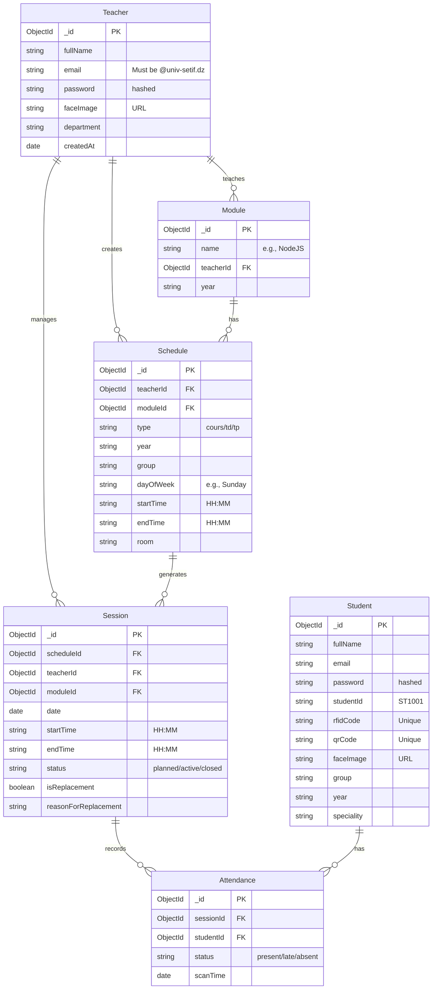

# Database Entity Relationship Diagram

You can copy and paste the code block below into any Mermaid visualizer (like [Mermaid Live Editor](https://mermaid.live/)) to see a visual relationship chart of your database.

